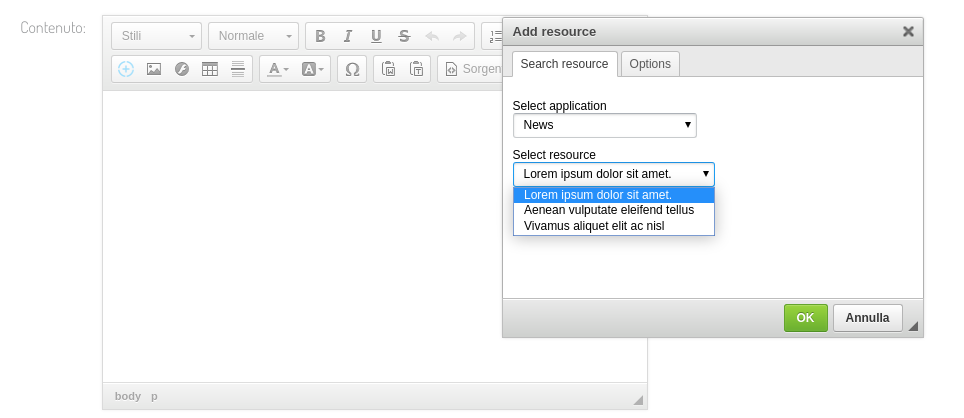
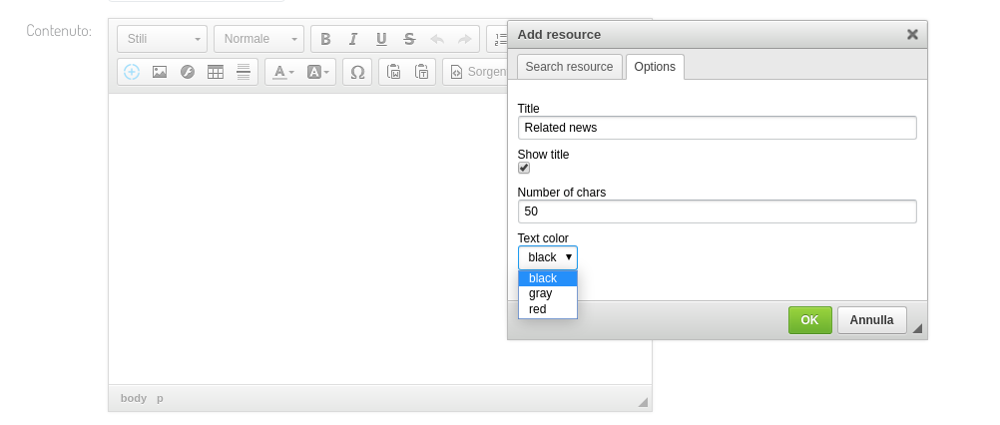

# django-resckeditor

This is a django app which provides and infrastructure you can use to include custom contents of other apps directly inside ckeditor.

It requires [django-ckeditor](https://github.com/django-ckeditor/django-ckeditor)

It defines a custom CKEDITOR plugin which implements two dialog tabs: the first to select the resource, and the second to dynamically set options.

**Full documentation**: [https://django-resckeditor.readthedocs.io/en/latest/](https://django-resckeditor.readthedocs.io/en/latest/)

## Getting Started

Install django-resckeditor:

    $ pip install django-resckeditor

Add resckeditor to your installed apps:

    INSTALLED_APPS = (
        # ...
        'ckeditor',
        'ckeditor_uploader',
        'resckeditor',
        # ...
    )

add the urls in your core application:

    urlpatterns = [
        # ...
        url(r'^resckeditor/', include('resckeditor.urls', namespace='resckeditor')),
    ]

**N.B.** do not change the **resckeditor** path, since it is hardcoded in the js code.

Add the resource and ajax plugins to your ckeditor instance:

    CKEDITOR_CONFIGS = {
        'default': {
            'skin': 'moono',
            'toolbar_Full': [
                    // ..
                    ['Res'/*, ...*/],
                    // ..
            ],
            'toolbar': 'Full',
            // ...
            'extraPlugins': 'ajax,resource',
        }
    }

Define functions export resources for ckeditor, so for example in your settings:

    RESCKEDITOR_CONFIG = {
        'RESOURCES': [
            {
                'list': 'path.to.module.func.defining.resources',
                'output': 'path.to.module.func.returning.html',
                'label': 'My group of widgets'
            },
        ]
    }

The `list` function is invoked without arguments and should return a dictionary defining all the available resources
(i.e. all the news we want to export) and the available options:

    def my_list_function():
        res = []
        for n in News.objects.published():
            res.append({
                'label': n.title,
                'id': n.id
            })
        return {
            'resources': res,
            'options': [
                {
                    'type': 'text',
                    'name': 'news-dialog-options-section-title',
                    'label': 'Last News',
                    'default': ''
                },
                {
                    'type': 'checkbox',
                    'name': 'news-dialog-options-show-title',
                    'label': 'Show title',
                    'default': True
                },
                {
                    'type': 'number',
                    'name': 'news-dialog-options-num-chars',
                    'label': 'Number of chars',
                    'default': 50
                },
                {
                    'type': 'select',
                    'name': 'news-dialog-options-layout',
                    'label': 'Layout',
                    'data': [
                        {'label': 'one row', 'value': 'row'},
                        {'label': 'two columns', 'value': 'col-2'},
                        {'label': 'three columns', 'value': 'col-3'},
                        {'label': 'four columns', 'value': 'col-4'},
                    ]
                }
            ]

        }

The `output` function will receive the id of the resource selected and a dictionary containing the provided options.
It should return the html output of the resource.

    def my_output_function(id, options):
        n = News.objects.get(pk=id)
        return '<h1>%s</h1>' % n.title

## Supported options

Currently only 4 types of options are supported: checkbox, text, number and select, but should be sufficient for almost all use cases.
The syntax and required properties are the one you may se in the example above (text has the same props as number).
